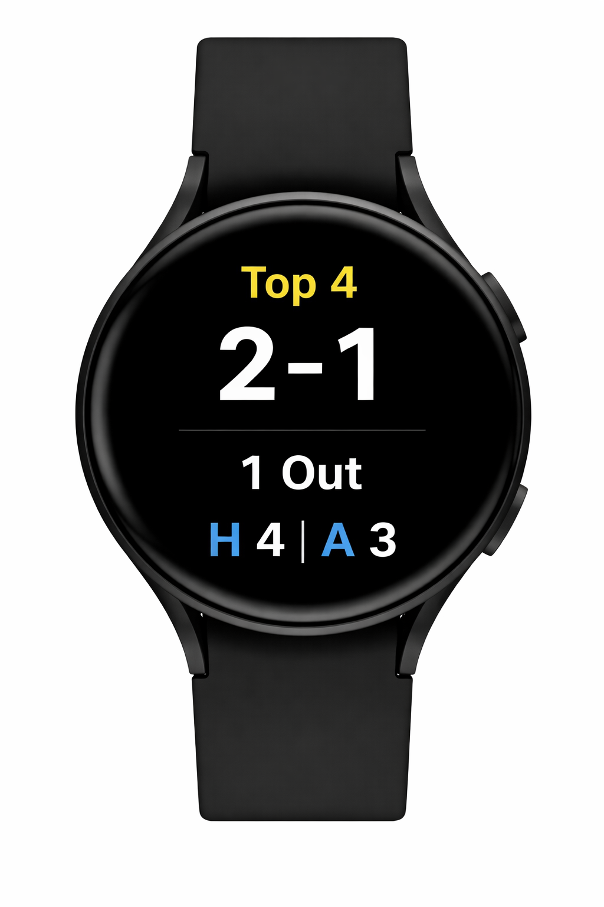

## Demo Preview

A smartwatch companion that surfaces live baseball game state (inning, count, outs, score) in a glanceable dashboard—so you never need to pull out your phone during a game.

## Why This Matters
During live games, constantly checking a phone for count, outs, and inning is distracting and inefficient. This project solves that by delivering real-time game state directly to a smartwatch in a clean, glanceable format.

## Current Status
Planning and design phase complete  
Next step: build phone-to-watch sync MVP

## Tech Direction
- Kotlin (Android)
- Wear OS (Samsung Galaxy Watch)
- Phone-to-watch sync via Data Layer API

# Game Day Watch Companion

## Overview
A companion app designed to display real-time baseball game state (inning, count, outs, score) on a smartwatch without needing to pull out a phone.

## Problem
When using GameChanger, key game data is available on the phone but not easily glanceable during live play. Users must constantly unlock their phone to check count, outs, and inning.

## Solution
This project creates a phone-to-watch companion system that:
- Captures current game state from a live source
- Maintains a single "game state" model
- Syncs that state to a smartwatch
- Displays a clean, glanceable dashboard

## Core Features (MVP)
- Inning (Top/Bottom)
- Balls / Strikes
- Outs
- Home / Away Score
- Real-time sync to smartwatch

## Architecture
GameChanger App (data source)
        ↓
Phone Companion App (state engine)
        ↓
Smartwatch Dashboard (Wear OS)

## Tech Stack (Planned)
- Kotlin
- Android Studio
- Wear OS
- Data Layer API

## Roadmap
- [ ] Build phone app state model
- [ ] Build watch dashboard UI
- [ ] Implement phone → watch sync
- [ ] Explore GameChanger data ingestion
- [ ] Add watch Tile support
- [ ] Add complication support

## Future Enhancements
- Watch Tile support
- GameChanger data ingestion
- Custom alerts (e.g., scoring plays)

## Status
Planning phase
