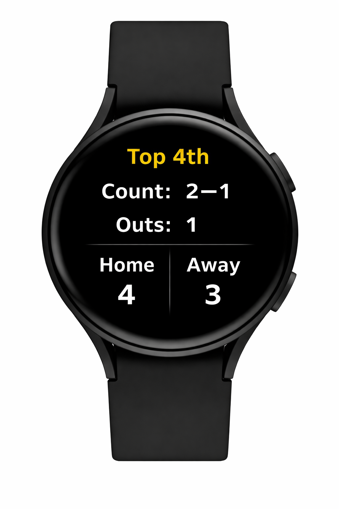
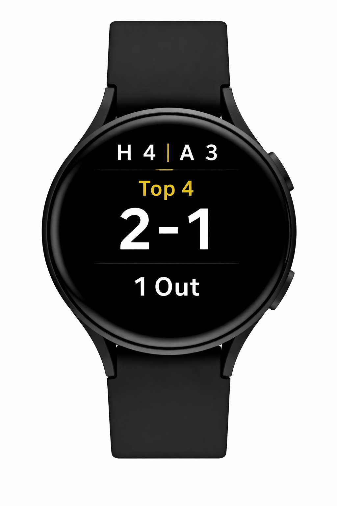

# Watch UI Concept

Top 4  
2-1  
1 Out  
H 4 | A 3  

## Design Goals
- Glanceable in <1 second
- Large text
- Minimal interaction required

# Watch UI Concepts

## Version 1 – Minimal (Recommended MVP)

### Notes
- Fastest to read at a glance
- Prioritizes count and inning
- Best for live gameplay situations

---

## Version 2 – Detailed

### Notes
- More descriptive labels
- Easier for new users to understand
- Slightly slower to scan during live play

---

## Version 3 – Score First

### Notes
- Emphasizes score at the top
- Useful in close or late-game situations
- Less focus on pitch count
